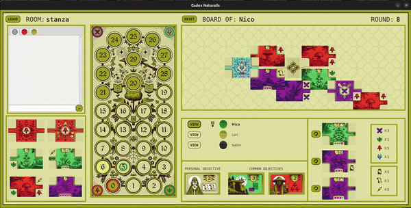

# Codex Naturalis - Software Version

"*Codex Naturalis*" is a strategy card game created by *[Cranio Creations](https://www.craniocreations.it/)*, now implemented in a software version using Java. This project was developed as part of the Software Engineering course at Politecnico di Milano, Academic Year 2023-2024.

**Professor:** Alessandro Margara

**Group:** AM-49

**Team:**
- [Salim Salici](https://github.com/SalimSalici)
- [Niccolò Benetti](https://github.com/NiccoloBenetti)
- [Trombini Lorenzo](https://github.com/L-Trombini-Polimi)
- [Matteo Scarlino](https://github.com/mttscrl)

<!--**Final Grade:** -->

## Table of Contents

- [Project Information](#project-information)
- [Implemented Features](#implemented-features)
- [Running the Game](#running-the-game)
- [Testing](#testing)
- [Documentation](#documentation)
- [License](#license)

## Project Information

The project involves the development of a software version of the Codex Naturalis board game. The final version includes:
- High-level and detailed UML diagrams generated from the source code.
- A working game implementation that adheres to the official rules.
- Documentation of the communication protocol between client and server.
- Source code of unit tests.
- Javadoc documentation generated from the code.

## Implemented Features

| Feature                        | Status             |
|--------------------------------|--------------------|
| Basic Rules                    | :white_check_mark: |
| Complete Rules                 | :white_check_mark: |
| Textual User Interface (TUI)   | :white_check_mark: |
| Graphical User Interface (GUI) | :white_check_mark: |
| Socket Communication           | :white_check_mark: |
| RMI Communication              | :white_check_mark: |
| Multiple Games                 | :white_check_mark: |
| Data Persistence               | :white_check_mark: |
| Disconnection Resilience       | :white_check_mark: |
| Integrated Chat                | :white_check_mark: |



## Running the Game
The game is divided into two JAR files, available for download from the [Deliverables directory](path to dir).
<br>To start a non-local game, ensure that a Server application instance is running before the client attempts to connect.</br>


### Running the Server

```sh
java -jar target/server.jar
```

### Running the Client

#### GUI Mode

```sh
java -jar target/client.jar --gui
```

#### CLI Mode

```sh
java -jar target/client.jar
```

To play the game using a socket connection, add the --socket option to the client command.

## Testing

The project includes extensive unit tests to ensure the correctness and stability of the implementation.    

## Documentation

### Javadoc

The complete Javadoc documentation can be generated by running:

```sh
mvn javadoc:javadoc
```

## License

Codex Naturalis is owned by Cranio Creations. All copyrighted graphical assets utilized in this project were supplied by Politecnico di Milano in partnership with the respective copyright owners.
